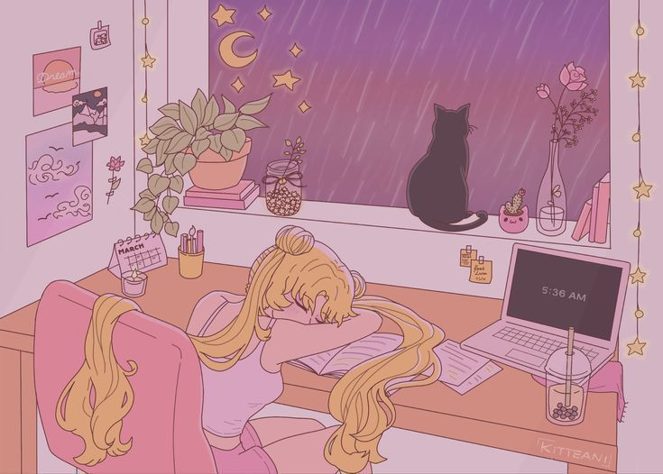

    

  

 

  
  
  

 

  

 
<h1 align="center">
   
  Hello! I'm Neno. Welcome to My GitHub Profile
</h1>
 

   

---

### 👩🏾‍💻 About Me :
I am a Frontend Web Developer  from Dallas, TX. 

- 👩🏾‍💻 I'm currently working as a Web Development and Design Team Lead contributing to web development projects for different clients
- 👀 I’m interested in anything UI/UX Design, Web Design and Web Development
- 🌱 I’m currently learning Backend Web Development

---

### :hammer_and_wrench: Languages and Tools :

  &nbsp;
  &nbsp;
  &nbsp;
  &nbsp;
  &nbsp;
  &nbsp;
  &nbsp;
  &nbsp;
  

---

### :fire: My Stats :

  

 

 

 
 

 

<!---
Neno-Craig17/Neno-Craig17 is a ✨ special ✨ repository because its `README.md` (this file) appears on your GitHub profile.
You can click the Preview link to take a look at your changes.
--->
